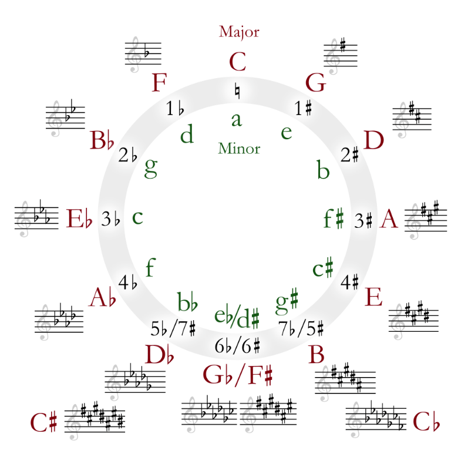

PyHarmonyTooling
================

# OVERVIEW
Series of tools to handle harmony in music

# Install

    pip install pyHarmonyTooling 

# Features
Usages of this library: 
* https://github.com/Moustov/pyHarmonyUI

> **Warning**
>
> All possible chord names are defined by the PyChord library
> See [here](https://github.com/yuma-m/pychord/blob/main/pychord/constants/qualities.py)

## Features on Harmony
### Find substitutes from a chord
It is possible to find a chord other names
    
    from pyharmonytools.harmony.cof_chord import CofChord

    chord = "G6"
    substitutes = CofChord.find_substitutes(Chord(chord))
    print("substitutes from :", chord, substitutes)

ouput _(detailed log skipped)_:

    substitutes from : G6 [<Chord: Em7>, <Chord: Em7/9>, <Chord: Em7/11>, <Chord: Em7/13>, <Chord: Em/D>, <Chord: Em7/B>, <Chord: Em7/D>, <Chord: Em7/G>, <Chord: Em7/9/B>, <Chord: Em7/9/D>, <Chord: Em7/9/G>, <Chord: Em7/11/B>, <Chord: Em7/11/D>, <Chord: Em7/11/G>, <Chord: Em7/13/B>, <Chord: Em7/13/D>, <Chord: Em7/13/G>, <Chord: G6>, <Chord: G6/9>, <Chord: G/E>, <Chord: G6/B>, <Chord: G6/D>, <Chord: G6/E>, <Chord: G6/9/B>, <Chord: G6/9/D>, <Chord: G6/9/E>]
 

See [related unit tests](test/1_objects_tests/test_circle_of_5th.py)

### Guess chord from notes
To guess a chord from notes, there is a feature that enables: 
- to have a list of possible chords that include all the provided notes
- to limit this list to chord with exactly the same notes (`is_strictly_compliant=True`)
- to provide the simplest possible chord (`simplest_chord_only=True`)

Code sample:

    from pychord import Chord
    from pyharmonytools.harmony.cof_chord import CofChord
    from pyharmonytools.harmony.note import Note

    expected = [Chord("Cmaj7")]
    notes = [Note("C"), Note("E"), Note("G"), Note("B")]
    res = CofChord.guess_chord_name(notes, is_strictly_compliant=True, simplest_chord_only=True)
    print(res == expected)

output:

    True

See [related unit tests](test/1_objects_tests/test_cof_chord.py)

## Guitar tools
### Find chord fingering on a guitar
    from pyharmonytools.guitar_neck.fingering import Fingering

    fng = Fingering()
    f = fng.get_fingering_from_chord(Chord("C"))
    print(f)
output:

    [[0, 3, 2, 0, 1, 0], [0, 3, 2, 0, 1, 3], [3, 3, 2, 0, 1, 0], ... ]

### Find chords from tabs
This tool is done to guess involved chords from a guitar tab.
It is supposed to handle tab guitar techniques such as
* `h`:   Hammer-on
* `p`:   Pull-off
* `^`: Bend
* `/`:   Slide up
* `\`:   Slide down
* `~`:   Vibrato

The involved method is based on building chords
as long as the fret range is acceptable (Fingering.FINGERING_WIDTH)
and you have enough fingers or a tab
therefore, sometimes the chord guessing is not accurate
since musical phrases are not taken into account.

This wizard is then merely a guide you should check with both hears and fingers! :wink:

    from pyharmonytools.displays.console_for_guitar_tab import ConsoleForGuitarTab
    from pyharmonytools.guitar_tab.guitar_tab import GuitarTab

    tab = """
          e|--11-----11-----10-----11---|
          B|--11-----12-----11-----11---|
          G|--11-----13-----10-----11---|
          D|----------------------------|
          A|----------------------------|
          E|----------------------------|
    """
    gt = GuitarTab(tab_full)
    ConsoleForGuitarTab.display(gt)
Output

    ----------------
    Bar #0:
        D#m    G#m    A#     D#m    
    e|--11-----11-----10-----11----|
    B|--11-----12-----11-----11----|
    G|--11-----13-----10-----11----|
    D|-----------------------------|
    A|-----------------------------|
    E|-----------------------------|

If the tab if well formatted 
(only tabbed strings with names and | as bars separators), 
a whole song can be processes.
Among the unit tests, a chord guessing
of [Johann Sebastian Bach's Prelude for Cello, Suite No. 1 (BWV1007)](https://github.com/Moustov/pyharmonytooling/blob/master/test/1_objects_tests/test_guitar_tab.py#L112)
can be found.

See [related unit tests](test/1_objects_tests/test_guitar_tab.py)

## Song Processing
### Song processing tools on simple text song
It is possible to extracts chords from a song

        from pychord import Chord 
        from pyharmonytools.song.text_song import TextSongWithLineForChords

        song = """
                            A           E
                    Happy Birthday to you
                          E           A
                    Happy Birthday to you
                          A7            D
                    Happy Birthday dear (name)
                          A        E    A
                    Happy Birthday to you
                """
        the_song = TextSongWithLineForChords()
        the_song.digest(song)
        print(the_song.chords_sequence)
output: 

    [<Chord: A>, <Chord: E>, <Chord: E>, <Chord: A>, <Chord: A7>, <Chord: D>, <Chord: A>, <Chord: E>, <Chord: A>]

See [related unit tests](test/1_objects_tests/test_guitar_tab.py)

### Guess the tonality & mode of a song"
It is possible to guess a song tonality and the mode that goes along

    from pyharmonytools.displays.console import _HarmonyLogger
    from pyharmonytools.harmony.circle_of_5th import CircleOf5th
    
    _HarmonyLogger.outcome_level_of_detail = _HarmonyLogger.LOD_NONE
    
ouput: 

    [1.0, 'A', 'Natural Major', ['A', 'B', 'Db', 'D', 'E', 'Gb', 'Ab', 'Ab']]

### Guess borrowed chords in a song 
It is possible to guess borrowed chords from a song from a tonality point of view

    song = """
          C Dm Em F G Am Bdim Cm
          """
    cof = CircleOf5thNaturalMajor()
    cp = cof.digest_song(song)
    tone = cof.generate_circle_of_fifths()["C"]
    borrowed_chords = cof.get_borrowed_chords(tone, cp)
    print("   Borrowed chords:", borrowed_chords.keys())

ouput:

    Borrowed chords: dict_keys(['Cm'])
See [related unit tests](test/1_objects_tests/test_harmony_tools.py)

### Get degrees on a song from a guessed tonality
It is possible to guess a chord song from a degree point of view 

        from pychord import Chord
        from pyharmonytools.displays.unit_test_report import UnitTestReport
        from pyharmonytools.song.text_song import TextSongWithLineForChords

        song = """
                            A           E
                    Happy Birthday to you
                          E           A
                    Happy Birthday to you
                          A7            D
                    Happy Birthday dear (name)
                          A        E    A
                    Happy Birthday to you
                """
        the_song = TextSongWithLineForChords()
        the_song.digest(song)
        the_song.generate_degrees_from_chord_progression()
        assert (the_song.degrees == ['I', 'V', 'V', 'I', 'I7', 'IV', 'I', 'V', 'I'])

### Guess chord progressions ("cadences" in a song)
It is possible to guess remarkable cadences in a song

        from deepdiff import DeepDiff
        from pyharmonytools.displays.unit_test_report import UnitTestReport
        from pyharmonytools.song.text_song import TextSongWithLineForChords
        
        song = """
                            A           E
                    Happy Birthday to you
                          E           A
                    Happy Birthday to you
                          A7            D
                    Happy Birthday dear (name)
                          A        E    A
                    Happy Birthday to you
                """
        the_song = TextSongWithLineForChords()
        the_song.digest(song)
        the_song.generate_degrees_from_chord_progression()
        res = the_song.get_remarquable_cadences()
        expected = {'REMARQUABLE_CADENCES_NATURAL_MAJOR:AUTHENTIC CADENCE': [4]}
        diff = DeepDiff(res, expected, ignore_order=True)
        self.ut_report.assertTrue(diff == {})

The returned dictionary provides for each cadence the chord position the progression starts

### Transpose song chords
It is possible to transpose a song with a number_half_tone:

        from pychord import Chord
        from pyharmonytools.displays.unit_test_report import UnitTestReport
        from pyharmonytools.song.text_song import TextSongWithLineForChords

        song_happy_birthday = """
                            A           E
                    Happy Birthday to you
                          E           A
                    Happy Birthday to you
                          A7            D
                    Happy Birthday dear (name)
                          A        E    A
                    Happy Birthday to you
                """
        the_song = TextSongWithLineForChords()
        the_song.digest(song_happy_birthday)
        the_song.generate_degrees_from_chord_progression()
        res = the_song.transpose(number_half_tone=-5)
        expected = ['E', 'B', 'B', 'E', 'E7', 'A', 'E', 'B', 'E']
        self.ut_report.assertTrue(res == expected)

## Song Querying
### Song search & processing tools on Ultimate Guitar through Google.com
You may search and handle song lyrics & tabs

    from pyharmonytools.song.song import UltimateGuitarSong
    from pyharmonytools.song.ultimate_guitar_search import UltimateGuitarSearch
    
    ug_engine = UltimateGuitarSearch()
    query = "D Dm A"
    urls = ug_engine.search(query, 20)
    song = UltimateGuitarSong()
    for link in urls:
        print("===================================")
        song.extract_song_from_url(link)
        print(song.get_string())

This piece of code will display 20 songs matching the query (songs holding the "D/Dm/A" cadence)

Output:

    ===================================
    Title: AUTREFOIS
    Artist: Pink Martini
    [tab][ch]A[/ch]                                     [ch]D[/ch]\r\nJ'ai ecris des mots doux а toutes les filles de France[/tab]\r\n
    [tab][ch]Dm[/ch]                    [ch]A[/ch]\r\nJ'espere qu'elles y repondent[/tab]\r\n
    [tab][ch]A[/ch]                  [ch]D[/ch]           [ch]Dm[/ch]               [ch]A[/ch]\r\nJ'ai jure que je serai content avant la fin de l'annee[/tab]\r\n
    [tab][ch]A[/ch]                                     [ch]D[/ch]\r\nJ'ai ecris des mots doux а toutes les filles de France[/tab]\r\n
    [tab][ch]Dm[/ch]                    [ch]A[/ch]\r\nChaque jour et chaque nuit[/tab]\r\n
    ...

See [related unit tests](test/3_online_tests/test_ultimate_guitar_search.py)

### Song search from a cadence
Searching for songs in the 12 tones from a cadence

        from pyharmonytools.harmony.circle_of_5th import CircleOf5thNaturalMajor
        from pyharmonytools.song.ultimate_guitar_search import UltimateGuitarSearch
        
        ugs = UltimateGuitarSearch()
        cadence = "V-IV-#ii7-VII-vii7-I-V"
        
        cadence_and_tone = Cadence.guess_tone_and_mode_from_cadence(cadence)
        MAX_SONG_PER_SEARCH = 5
        
        cof = CircleOf5th.cof_factory(cadence_and_tone["cof_name"])
        songs = ugs.search_songs_from_cadence(cadence, cof, MAX_SONG_PER_SEARCH, matches_exactly=True,
                                              try_avoiding_blocked_searches=True)
        print(songs)
output:

        {'Bm7 E7 Amaj7 ': 
                ['https://tabs.ultimate-guitar.com/tab/1726600', 
                'https://tabs.ultimate-guitar.com/tab/henri-salvador/jardin-dhiver-chords-2202243', 
                'https://tabs.ultimate-guitar.com/tab/2330957', 
                'https://tabs.ultimate-guitar.com/tab/slimane/a-fleur-de-toi-chords-1873948', 
                'https://tabs.ultimate-guitar.com/tab/1707559'],
        'Cm7 F7 A#maj7 ': 
                ['https://tabs.ultimate-guitar.com/tab/louis-armstrong/a-kiss-to-build-a-dream-on-chords-923726', 
                'https://tabs.ultimate-guitar.com/tab/amy-winehouse/mr-magic-chords-1828391', 
                'https://tabs.ultimate-guitar.com/tab/amy-winehouse/mr-magic-chords-1828391', 
                'https://tabs.ultimate-guitar.com/tab/stevie-wonder/lately-chords-173491', 
                'https://tabs.ultimate-guitar.com/tab/louis-armstrong/a-kiss-to-build-a-dream-on-chords-923726'], 
        'C#m7 F#7 Bmaj7 ': 
                ['https://tabs.ultimate-guitar.com/tab/jvke/this-is-what-falling-in-love-feels-like-chords-3871874', 
                'https://tabs.ultimate-guitar.com/tab/jvke/this-is-what-falling-in-love-feels-like-chords-3871874', 
                'https://tabs.ultimate-guitar.com/tab/jvke/this-is-what-falling-in-love-feels-like-chords-3871874', 
                'https://tabs.ultimate-guitar.com/tab/jvke/this-is-what-falling-in-love-feels-like-chords-3871874', 
                'https://tabs.ultimate-guitar.com/tab/jvke/this-is-what-falling-in-love-feels-like-chords-3871874'], 
        'Dm7 G7 Cmaj7 ': 
                ['https://tabs.ultimate-guitar.com/tab/frank-sinatra/fly-me-to-the-moon-chords-1193296', 
                'https://tabs.ultimate-guitar.com/tab/frank-sinatra/fly-me-to-the-moon-chords-1193296', 
                'https://tabs.ultimate-guitar.com/tab/grover-washington-jr-/just-the-two-of-us-chords-1095786', 
                'https://tabs.ultimate-guitar.com/tab/michel-fugain/une-belle-histoire-chords-391387', 
                'https://tabs.ultimate-guitar.com/tab/michel-fugain/une-belle-histoire-chords-391387'], 
        'D#m7 G#7 C#maj7 ': 
                ['https://tabs.ultimate-guitar.com/tab/941025', 
                'https://tabs.ultimate-guitar.com/tab/941025', 
                'https://tabs.ultimate-guitar.com/tab/941025', 
                'https://tabs.ultimate-guitar.com/tab/941025', 
                'https://tabs.ultimate-guitar.com/tab/941025'], 
        'Em7 A7 Dmaj7 ': 
                ['https://tabs.ultimate-guitar.com/tab/eric-clapton/autumn-leaves-chords-2502690', 
                https://tabs.ultimate-guitar.com/tab/eric-clapton/autumn-leaves-chords-2502690', 
                'https://tabs.ultimate-guitar.com/tab/eric-clapton/autumn-leaves-chords-2502690', 
                https://tabs.ultimate-guitar.com/tab/eric-clapton/autumn-leaves-chords-2502690', 
                'https://tabs.ultimate-guitar.com/tab/frank-sinatra/the-way-you-look-tonight-ukulele-1485850'], 
        'Fm7 A#7 D#maj7 ': 
                ['https://tabs.ultimate-guitar.com/tab/michael-jackson/i-just-cant-stop-loving-you-chords-967366', 
                'https://tabs.ultimate-guitar.com/tab/michael-jackson/i-just-cant-stop-loving-you-chords-967366', 
                'https://tabs.ultimate-guitar.com/tab/michael-jackson/i-just-cant-stop-loving-you-chords-967366', 
                'https://tabs.ultimate-guitar.com/tab/michael-jackson/i-just-cant-stop-loving-you-chords-967366', 
                'https://tabs.ultimate-guitar.com/tab/frank-sinatra/the-way-you-look-tonight-chords-1771608'], 
        F#m7 B7 Emaj7 ': 
                ['https://tabs.ultimate-guitar.com/tab/3709742', 
                'https://tabs.ultimate-guitar.com/tab/misc-soundtrack/la-la-land-audition-the-fools-who-dream-chords-1909336', 
                'https://tabs.ultimate-guitar.com/tab/julie-london/cry-me-a-river-chords-1499105', 
                'https://tabs.ultimate-guitar.com/tab/h-e-r-/wrong-places-chords-3119678', 
                'https://tabs.ultimate-guitar.com/tab/h-e-r-/wrong-places-chords-3119678'], 
        'Gm7 C7 Fmaj7 ': 
                ['https://tabs.ultimate-guitar.com/tab/yves-montand/les-feuilles-mortes-chords-2576898', 
                'https://tabs.ultimate-guitar.com/tab/glen-campbell/by-the-time-i-get-to-phoenix-chords-2129751', 
                'https://tabs.ultimate-guitar.com/tab/yves-montand/les-feuilles-mortes-chords-2576898', 
                'https://tabs.ultimate-guitar.com/tab/glen-campbell/by-the-time-i-get-to-phoenix-chords-2129751', 
                'https://tabs.ultimate-guitar.com/tab/glen-campbell/by-the-time-i-get-to-phoenix-chords-2129751'], 
        'G#m7 C#7 F#maj7 ': 
                ['https://tabs.ultimate-guitar.com/tab/misc-soundtrack/la-la-land-audition-the-fools-who-dream-chords-1909336', 
                'https://tabs.ultimate-guitar.com/tab/tyler-the-creator/boredom-chords-2785219', 
                'https://tabs.ultimate-guitar.com/tab/tyler-the-creator/boredom-chords-2785219', 
                'https://tabs.ultimate-guitar.com/tab/tyler-the-creator/boredom-chords-2785219', 
                'https://tabs.ultimate-guitar.com/tab/yves-montand/les-feuilles-mortes-chords-2576898'], 
        'Am7 D7 Gmaj7 ': 
                ['https://tabs.ultimate-guitar.com/tab/billy-joel/just-the-way-you-are-chords-1404186', 
                'https://tabs.ultimate-guitar.com/tab/laufey/falling-behind-chords-4307414', 
                'https://tabs.ultimate-guitar.com/tab/billy-joel/just-the-way-you-are-chords-1404186', 
                'https://tabs.ultimate-guitar.com/tab/billy-joel/just-the-way-you-are-chords-1404186', 
                'https://tabs.ultimate-guitar.com/tab/john-mayer/new-light-chords-3180788'], 
        'A#m7 D#7 G#maj7 ': 
                ['https://tabs.ultimate-guitar.com/tab/george-benson/give-me-the-night-chords-61898', 
                'https://tabs.ultimate-guitar.com/tab/george-benson/give-me-the-night-chords-61898', 
                'https://tabs.ultimate-guitar.com/tab/george-benson/give-me-the-night-chords-61898', 
                'https://tabs.ultimate-guitar.com/tab/tyler-the-creator/boredom-chords-2785219', 
                'https://tabs.ultimate-guitar.com/tab/tyler-the-creator/boredom-chords-2785219']
                }

See [related unit tests](test/3_online_tests/test_ultimate_guitar_search.py)

## Next Features
_(in no specific order)_
* Chords stuff
  * chord comping : provide chord fingering from a soprano (or bass) note + chord name - see
    * https://www.youtube.com/watch?v=nUq6PArEnuY)
    * https://www.jazzguitarlessons.net/blog/ultimate-guide-jazz-guitar-chords
  * build a database from chord transitions (event log mechanism could be used)
  * find similar songs from chord sequences (options: sequence is included / only cadence)
  * find key changes in songs
  * guess dominant key, subdominant, and relative minor https://getsongkey.com/song/fool-to-cry/DQAGB
* Tabs stuff
  * take guitar tuning into account when handling guitar tabs
  * display degrees in guitar tabs
  * transpose guitar tabs
  * update tabs with guitar tuning
  * guess rhythm from guitar tab
  * use rhythm in guitar tab to guess phrases and improve chord guessing
  * analyze found chords from tabs to make them more consistent (notably with the CoF or b/#)

# Test report
see [here](unit_test_report.md)

# Release Notes
* 02/MAR/23
  * scales start from C
  * package v0.8.1
* 28/FEB/23
  * notes frequencies exposed
  * package v0.8.0
* 27/FEB/23
  * Neck.find_position_from_note handles note synonyms 
  * Neck.find_position_from_note handles octaves
  * package v0.7.5
* 22/FEB/23
  * closest pitch from chciken
  * package v0.7.1
* 20/FEB/23
  * estimating note from frequency
  * package v0.7.0
* 18/JAN/23
  * capture songs from UG (see [ultimate_guitar_capture.py](song/ultimate_guitar_capture.py))
* 16/JAN/23
  * cadence with b/# before degree
  * enharmonic notes fixed
  * package v0.6.1
* 14/JAN/23
  * CoF detailed in triads & 4 notes
  * package v0.6.0
* 09/JAN/23
  * transpose song chords
  * github building ok
  * package v0.5.1
* 08/JAN/23
  * spot remarkable cadences in a song
  * hardening UG searches
  * package v0.4.0
* 06/JAN/23
  * degrees from song chords 
  * package v0.3.1
* 01/DEC/22
  * displaying tabs with chords
  * handling guitar gimmicks in tabs
* 30/NOV/22
  * a tab on multiple bars can be processed
  * package v0.2.1
* 28/NOV/22
  * chords can be guessed from a tab
  * package v0.1.4
* 26/NOV/22
  * unit test report (see [here](unit_test_report.md)) + [CONTRIBUTING.md](CONTRIBUTING.md)
* 25/NOV/22
  * start reading guitar tabs when chords are vertical or played in arpeggio
* 24/NOV/22
  * weird notes (eg. Cb)
  * possible chords cached for optimization
  * package v.0.1.2
* 23/NOV/22 - tag 
  * find chords from notes
  * start parsing tabs
* 20/NOV/22
  * accurate song search (param added)
  * find songs that match a cadence in degrees
* 19/NOV/22
  * starting API to ultimate-guitar.com
  * querying UG through google.com to retrieve pattern matching over possibilities found in UG
  * circle of 5th extended to Natural/Melodic/Harmonic minors
* 12/NOV/22: 
  * bugs when finding chord fingering on a guitar on vertical fingering such a barres

# Additional links
* Theory of music:
  * Lectures in 🇫🇷: https://www.youtube.com/@gradusadparnassumfr
    * Cours d'harmonie (chapitre I): https://www.youtube.com/watch?v=kYbmplpgls8&list=PLyIR6Ix26WY9lELxy0dpDOpjfmYLTGsHA
    * Cours d'harmonie (chapitre II): https://www.youtube.com/watch?v=aoe-5-JCadA&list=PLyIR6Ix26WY9ww90jZ7z9OnE1RxbUWr4x
  * Guide to Chord Symbols: https://www.musicnotes.com/now/tips/a-complete-guide-to-chord-symbols-in-music/
  * few tools: https://muted.io/
  * https://getsongkey.com/song/fool-to-cry/DQAGB
* Circle of Fifths: 
  * https://websemantics.uk/tools/circle-of-fifths-chord-wheel/
  * https://en.wikipedia.org/wiki/Circle_of_fifths
  * Nice GUI on the Cof major: https://codepen.io/2kool2/pen/bmVxpZ
* Guitar tools:
  * https://www.oolimo.com/guitarchords/analyze
  * Notes from chords + fingering: https://chord-c.com/guitar-chord/B/minor-eleventh/
  * Interactive circle of fifths for guitarists: https://guitardashboard.com/
* Python:
  * Python in music: https://wiki.python.org/moin/PythonInMusic 
  * Pypi Home Page: https://pypi.org/project/pyHarmonyTooling/
  * PyChord project: https://github.com/yuma-m/pychord
  * An API to UG: https://github.com/victorfontes/python-ultimate-guitar
  * A Toolkit for Computer-Aided Musical Analysis and Computational Musicology: https://github.com/cuthbertLab/music21
